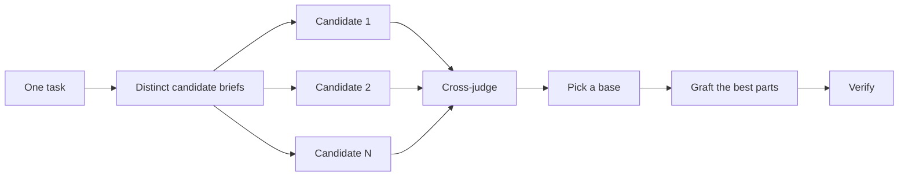

# Design before you write code

One attempt at a hard design locks in the first shape the worker thought of. `/architect` settles types and boundaries before implementation. `/arena` pursues several directions toward the same goal and merges the best parts. `/interrogate` gives fresh-context judges distinct ways to try to break the result. When the job is coverage rather than design synthesis, `/swarm` fans out slices or races and aggregates their results.


## Settle the shape with `/architect`

```text
/architect design the import pipeline before writing any code. i care most about how callers use it.
```

[`/architect`](../../skills/architect/SKILL.md) grounds itself first, running `/how` over the code the design touches and `/why` when it moves ownership or layers. Then it runs `/arena` to produce competing design sketches, with the caller's usage written first in each, followed by types, signatures, and a module map.

By default it proceeds straight from the synthesized design into implementation. If you want to see the design first, say so:

```text
/architect with checkpoint. stop and show me before implementing.
```

## Fan out attempts with `/arena`

```text
/arena take my prompt to the arena verbatim. i want to compare their proposals with yours.
```

[`/arena`](../../skills/arena/SKILL.md) is the general tool underneath. N isolated workers receive one shared base contract — goal, context, acceptance criteria, and non-negotiable constraints — plus a distinct candidate direction, using `explore` for designs and `implement` for writable candidates. A controlled evaluation may deliberately keep the complete brief identical. A read-only `judge` scores every candidate against a rubric. The coordinator reads each candidate end to end, picks a base, grafts in the best ideas from the losers, then hands the result to `verify`.



The workflow picks the task profiles. [`/setup-ronin`](../../skills/setup-ronin/SKILL.md) may tune their model or effort, but it does not set panel size. Ask for more candidates when the decision warrants more distinct directions, fewer when it doesn't:

```text
/arena this, 5 candidates. the cache key format is expensive to change later.
```

## Cover slices and races with `/swarm`

```text
/swarm check every package under packages/ against its check.sh. one worker per package. one report.
```

[`/swarm`](../../skills/swarm/SKILL.md) fans N workers across independent slices, coverage matrices, gauntlet lanes, exploration partitions, or declared race arms. Each worker gets its own scope and check, then reports `PASS`, `ISSUES`, or `BLOCKED`. The parent waits for the workers and returns one compact report with any gaps or dropouts.

Reach for it when parallelism buys coverage or lets independent checks race. `/arena` gives every worker the shared base contract plus a distinct candidate direction, then picks a base and grafts the best parts. A controlled evaluation may deliberately hold the complete brief identical. `/swarm` covers slices or runs a race with a selection rule declared up front. It does not use the base-selection and grafting ceremony.

## Break it with `/interrogate`

```text
/interrogate the whole branch, but skeptically. no nitpicks unless it's an actual bug or regression.
```

[`/interrogate`](../../skills/interrogate/SKILL.md) sends the same diff, intent, and rubric to several fresh-context `judge` workers with different primary lenses. A model route may be chosen for a demonstrated capability fit, but the panel's breadth comes from the lenses and its confidence comes from reproducible evidence. The lead sorts everything into `Act on`, `Consider`, `Noted`, and `Dismissed`, and records review provenance without treating model identity or head count as proof.

Read the dismissals too. The lead is a pragmatic senior engineer, not an oracle, and you can override it.

## How much design work does a task deserve?

You might be wondering whether every change needs this. No. Most changes need none of it. A rough ladder:

- A small, finished change you're unsure about needs `/interrogate` alone.
- A change that crosses function boundaries or moves ownership earns `/architect`, which brings `/arena` with it.
- A standalone decision where independent attempts would help, like naming, formats, or an algorithm, is `/arena` directly.
- A coverage matrix, set of parallel checks, or race with declared arms is `/swarm`.
- A contested design that's expensive to reverse gets `/architect`, then `/interrogate` before shipping.

`/ronin-mode` already applies this ladder. Boundary-crossing work triggers `/architect` on its own, so you reach for these directly mainly when you want more or less scrutiny than the default.

Next: [Build and clean the change](./05-build-and-clean.md).
