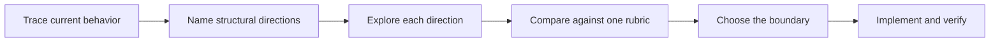

# Design before you write code

Hard designs need real alternatives. `/ronin-architect` names structurally different directions before any worker starts, then settles the caller, types, and module boundary.


## Settle the shape with `/ronin-architect`

```text
/ronin-architect design the import pipeline before writing code. i care most about how callers use it.
```

[`/ronin-architect`](../../skills/ronin-architect/SKILL.md) grounds itself with `/ronin-how` and uses `/ronin-why` when the change moves ownership or layers. It writes the caller's usage first. Types, signatures, and the module map follow.

The skill does not ask several identical workers to improvise variety. It names two or three structural directions first. A typical set looks like this:

- extend the current boundary;
- replace it with a new boundary;
- delete the abstraction and simplify the caller.

Workers can explore those directions in parallel. Their briefs differ because the designs differ. The coordinator compares the evidence, selects the shape, and records what the rejected directions taught it.

By default, architecture flows into implementation. Ask for a checkpoint when the choice is expensive to reverse:

```text
/ronin-architect with checkpoint. show me the directions and chosen shape before implementing.
```



## Cover independent slices with `/ronin-swarm`

```text
/ronin-swarm check every package under packages/ against its check.sh. one worker per package. one report.
```

[`/ronin-swarm`](../../skills/ronin-swarm/SKILL.md) partitions a coverage matrix, investigation, or declared race. Each worker owns one scope and one check. The parent waits for every lane and returns one `PASS`, `ISSUES`, or `BLOCKED` report.

Use swarm when the work divides cleanly. Do not use it to manufacture design alternatives. Architecture owns synthesis. Swarm owns coverage.

## Break the result with `/ronin-interrogate`

```text
/ronin-interrogate the whole branch, but skeptically. no nitpicks unless it is a real bug or regression.
```

[`/ronin-interrogate`](../../skills/ronin-interrogate/SKILL.md) sends the same diff and intent to fresh-context judges with different review lenses. One looks for correctness. Another looks for API and type failures. Another looks for verification gaps.

The lead sorts findings into `Act on`, `Consider`, `Noted`, and `Dismissed`. Evidence earns confidence. Head count does not.

## Spend design effort where reversal is expensive

- A small finished change you distrust needs `/ronin-interrogate`.
- A change that crosses a function boundary earns `/ronin-architect`.
- A contested boundary needs explicit structural directions and a checkpoint.
- A package matrix or set of independent checks needs `/ronin-swarm`.
- An expensive design gets `/ronin-architect`, then `/ronin-interrogate` before shipping.

`/ronin` already applies this ladder. Invoke a skill directly when you want to override the default amount of scrutiny.

Next: [Build and clean the change](./05-build-and-clean.md).
